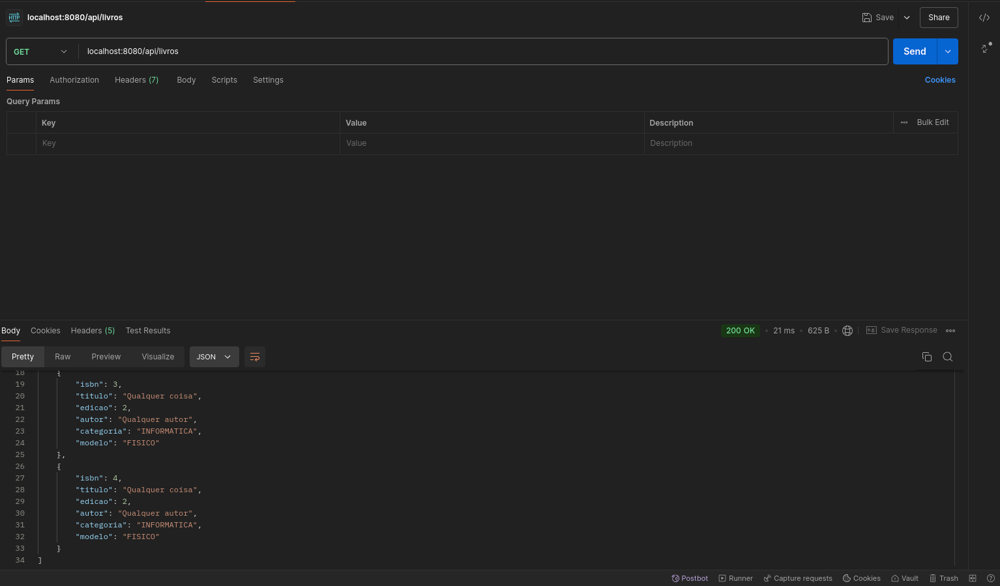
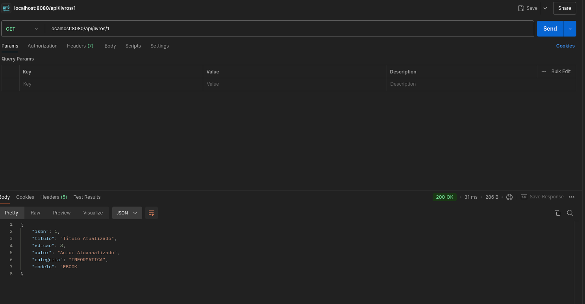
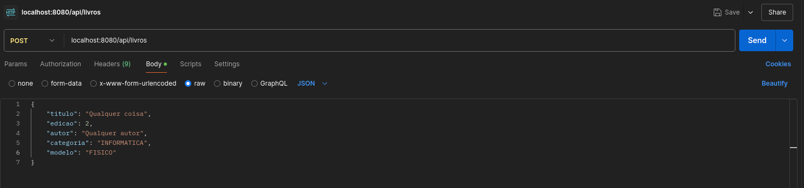
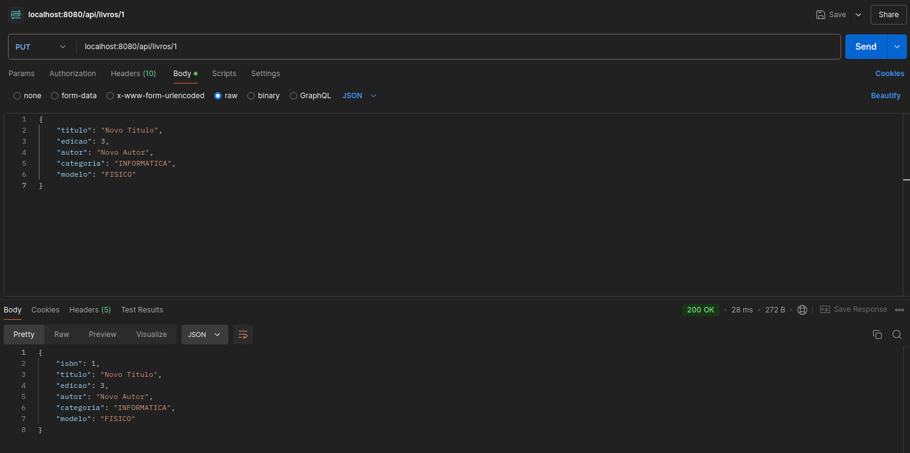
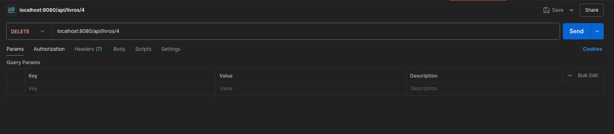

# Rest API

Uma aplicação para cadastro, atualização e visualização de livros, com um frontend simples desenvolvido utilizando HTMx

### Obtém todos os livros

### Obtém um livro específico

### Cria um livro

### Atualiza um livro

### Deleta um livro

